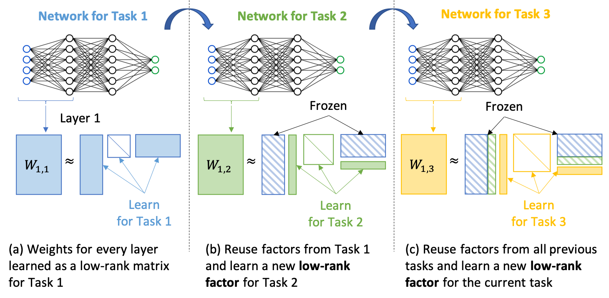

# Incremental Task Learning with Incremental Rank Updates

This repository is the official Pytorch implementation of *Rakib Hyder , Ken Shao , Boyu Hou, Panos Markopoulos ,
Ashley Prater-Bennette , and M. Salman Asif, "Incremental Task Learning with Incremental Rank Updates", European Conference on Computer Vision (ECCV), 2022.*

## Please see requirements.txt for dependencies.
## Intro
Incremental Task learning (ITL) is a category of continual learning that seeks to train a single network for multiple tasks (one after another), where training data for each task is only available during the training of that task. Neural networks tend to forget older tasks when they are trained for the newer tasks; this property is often known as catastrophic forgetting. To address this issue, ITL methods use episodic memory, parameter regularization, masking and pruning, or extensible network structures. In this paper, we propose a new incremental task learning framework based on low-rank factorization. In particular, we represent the network weights for each layer as a linear combination of several rank-1 matrices. We first represent (and learn) the weight matrix (or tensor) for each layer as a product of low-rank matrices. To train a network for new tasks without forgetting the earlier tasks, we learn a rank-1 (or low-rank) matrix and add that to the weights of every layer. We also introduce an additional selector vector that assigns different weights to the low-rank matrices learned for the previous tasks. Our experiments suggest that a rank-1 update is often sufficient for successful continual learning. We show that our approach performs better than the current state-of-the-art methods in terms of accuracy and forgetting. Our method also offers better memory efficiency compared to episodic memory- and mask-based approaches.

